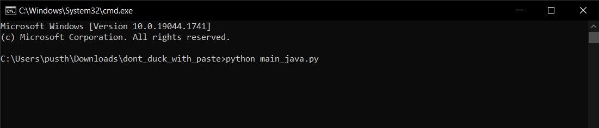
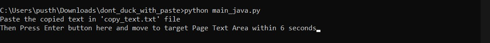
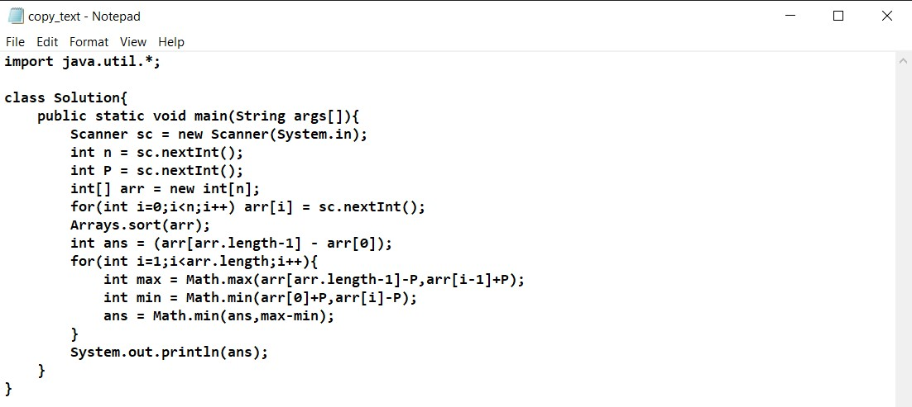
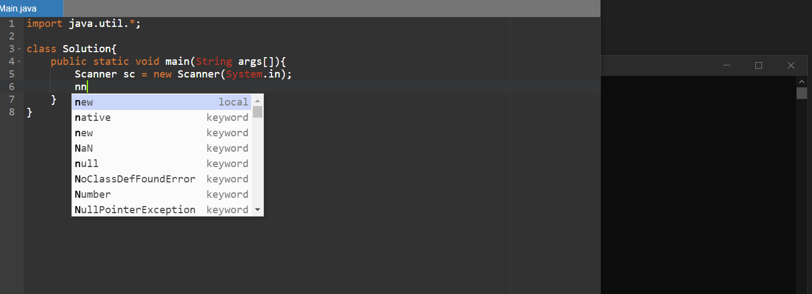

# dont_duck_with_paste
Alternative app for The great "Dont F*** With Paste".

# Steps to use the App
<b>Step 1.</b> Clone the repo to your system

<b>Step 2.</b> Make sure that you have all the dependencies satisfying for python (pyautogui and time) < pip install pyautogui && pip install time >

<b>Step 3.</b> Paste the text which you want to PASTE in the text area in copy_text.txt file 

<b>Step 4.</b> Now run the python script (# separate script for .py, .java and .cpp files) and follow the instructions dispalyed on the CLI

<b>Step 5.</b> Navigate to the text area where you want to paste the text

<b>Step 6.</b> Sit back and relax let the script do work for you!

<h2>CAUTION!</h2>

<i> main_(language_name) files are supported for auto-complete enabled text editors  
  For non auto-complete text editors use common.py file to do the same  
  
  The app is in the initial stages, So please feel free to contribute for furthur changes if needed!
</i>

# Screenshots for more help!
<h2> Step 1</h2>

<h2> Step 2</h2>

<h2> Step 3</h2>

<h2> Step 4</h2>

